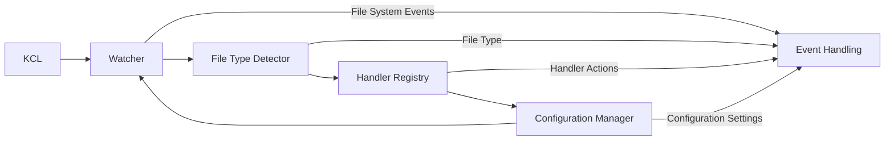

## KCL Watch System

### 1. Introduction
The KCL Watch System aims to monitor changes to files and directories within the KCL package directory. It dynamically detects file types based on their extensions and invokes corresponding handlers to perform actions upon changes. This system enhances the development experience by providing real-time feedback and enabling rapid iteration during development and continuous integration.

### 2. Design Research

I researched various file watching systems such as Pyright, TypeScript, and Rust Analyzer to understand their architecture and functionality. I found that these systems share a similar core architecture and interface functionalities:

**Typescript:**
- Offers a file watching API through libraries like `fs.watch` or `chokidar`.
- Core interface functionalities include initializing a watcher, registering watch paths, defining event handlers, and error handling.
- Configuration can be done via `tsconfig.json` to customize watch behavior.

**Pyright:**
- Utilizes the `watchdog` library for file system monitoring.
- Core interface functionalities align with those of other languages: initializing a watcher, registering watch paths, handling events, and error handling.
- Reference: [Watchdog](https://github.com/gorakhargosh/watchdog)

**Rust Analyzer:**
- Uses the `notify` crate for file system monitoring.
- Core interface includes initializing a watcher, registering watch paths, defining event handlers, and handling errors.
- Configuration is done via `watch.toml` to customize watch tasks, file patterns to watch, ignore patterns, and commands to execute upon file changes.
- Reference: [Cargo Watch](https://crates.io/crates/cargo-watch)

### 3. Architecture Overview

#### 3.1 Watcher
- Utilizes a file system notification library (e.g., `notify`) to monitor changes to files and directories.
- Maintains a list of registered watch paths and corresponding event handlers.
- Runs asynchronously to minimize latency and improve responsiveness.

#### 3.2 File Type Detector
- A file detector analyzes files to determine their types based on their extensions like `.k, .mod, .JSON, .YAML`, etc.
- Provides a mapping of file types to corresponding handlers.

#### 3.3 Handler Registry
- Registers and manages operations for different file types defined above.
- Handlers define actions to be executed upon file system events (e.g., file creation, modification, deletion).

#### 3.4 Configuration Manager
- Manages configuration settings for the KCL Watch System.
- Allows developers to specify watch paths, file types, and handler configurations.
- Supports configuration via configuration files (e.g., `kcl.toml`).

### 4. Core API of Watch System (Rough design, actual implementation might differ during development)

#### 4.1 Watcher API
- `initialize()`: Initializes the watcher component.
- `registerPath(path: string)`: Registers a path to monitor for file system events.
- `unregisterPath(path: string)`: Unregisters a path from monitoring.
- `on(event: string, handler: Function)`: Registers an event handler for a specific file system event.
- `start()`: Starts the watcher to begin monitoring registered paths.
- `stop()`: Stops the watcher and clears all registered paths and handlers.

#### 4.2 File Type Detector API
- `detectFileType(filePath: string): string`: Determines the file type based on its extension.

#### 4.3 Handler Registry API
- `registerHandler(fileType: string, handler: Function)`: Registers a handler for a specific file type.
- `unregisterHandler(fileType: string)`: Unregisters a handler for a specific file type.

#### 4.4 Configuration Manager API
- `loadConfig(configPath: string)`: Loads configuration settings from a specified configuration file.
- `setWatchPaths(paths: string[])`: Sets the watch paths based on the configuration.
- `setHandlerConfigurations(config: Object)`: Sets handler configurations based on the configuration file.

### 5. Architecture Diagram (Mermaid.js)

### 6. Integration with KCL Language Server(to be implemented)

To integrate the KCL Watch System with the KCL language server, I am going follow these steps:

#### 6.1 Import Necessary Modules
- In `main.rs`, import the required modules from the KCL Watch System(to be implemented).

#### 6.2 Initialize KCL Watch System
- Then I will modify the `run_server` function in `main.rs` to initialize the KCL Watch System.

#### 6.3 Integrate File Watching with Language Server
- Then I will modify the `main_loop` function in `main_loop.rs` to handle file watching events.

#### 6.4 Implement Watch Handlers
- Also need to create a new module `kcl_watch_system.rs` to implement the watch system integration.

#### 6.5 Update File Watching Event Handling
- Then In `notification.rs`, add the necessary event handlers for file watching events.
