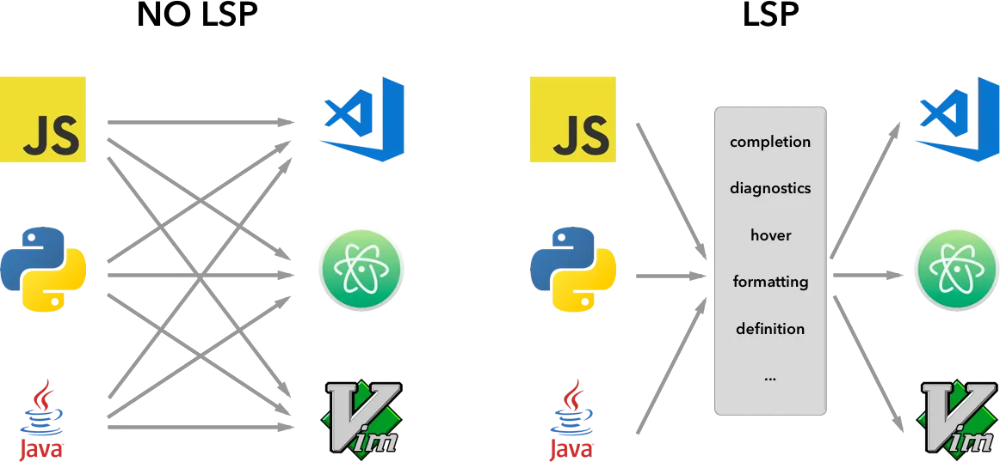
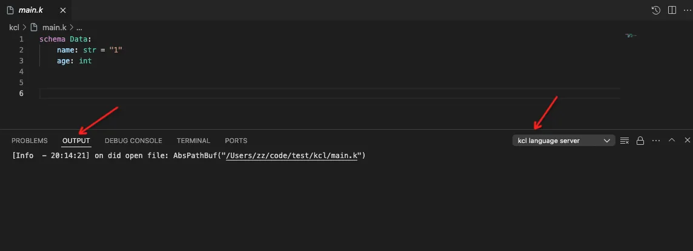

# KCL Language Server Dev Guide

## About the guide

This guide describes the design and implementation of KCL Language Server and can help you better understand KCL Language Server.

## What is Language Server Protocl

[Language Server Extension Guide](https://code.visualstudio.com/api/language-extensions/language-server-extension-guide)

Language Server is a special kind of Visual Studio Code extension that powers the editing experience for many programming languages. With Language Servers, you can implement autocomplete, error-checking (diagnostics), jump-to-definition, and many other language features supported in VS Code.

Microsoft specified Language Server Protocol, which standardizes the communication between language tooling and code editor. This way, Language Servers can be implemented in any language and run in their own process to avoid performance cost, as they communicate with the code editor through the Language Server Protocol. Furthermore, any LSP-compliant language toolings can integrate with multiple LSP-compliant code editors, and any LSP-compliant code editors can easily pick up multiple LSP-compliant language toolings. LSP is a win for both language tooling providers and code editor vendors!



## KCL Language Server Overview


### Workflow

When a user opens a kcl file in an IDE (taking VSCode as an example), the IDE plugin will be started, and the plugin will execute `kcl-language-server` in the PATH to run the server binary.
The server side mainly has the following steps:

+ Setup stdio connections
+ Parse initialize params from client
+ Construct and send server-side capabilities to the client. These capabilities indicate which features the server implements, such as highlighting, completion， hover. For features that are not implemented, the client will not send those requests in subsequent communications.
+ execute `main_loop()`，it will new a `LanguageServerState`  and execute the method `run()`.
+ `LanguageServerState` receive Events and distributes them to threadpool for processing.
+ Process changes, The function process_vfs_changes() retrieves the changed (including create, deleted and modify) files from vfs. Compile new files based on cache, and write new compilation results (AST, and semantic information GlobalState) to db. If some compilation errors occured, the server will actively send diagnostics to the client without require from the Client.

### Key concepts and structs

#### LanguageServerState

LanguageServerState is an important structure on the server side. It mainly consists of the following parts:

+ Sender:  Channel to send language server messages to the client.
+ Task sender and receiver:  Channel to send and receive tasks to from background operations.
+ analysis: Holds the state(compile result and sema information) of the analysis process.
+ vfs: The virtual filesystem that holds all the file contents, mainly to solve the situation where changes in the IDE are not saved to the file system.
+ Various caches: Caching of multiple compilation stages to improve performance.

#### LanguageServerSnapshot

LanguageServerSnapshot is snapshot of the state of the language server. It copies the current state of LanguageServerState and handles various tasks in threads.

#### Event

Currently, Events are mainly divided into two categories:

+ Task: Internal task scheduling on the server side. mainly include
  + Notification: Send notification to the Client, mainly used to send some Log information
  + Response: Send response to the Client. When each sub-thread processes the LSP request, it does not communicate directly with the client. Instead, first send `Task(Response(r))` on the server side, and then `LanguageServerState.sender.send(r)`
  + Retry: Retry some requests
+ LSP Message:
  + LSP Notification: LSP notification does not need to be returned by the server. For example, open files, close files, change file, etc.
  + LSP Request: LSP request needs to be returned by the server. For example, goto definition, hover.

For different Events, `handle_event()` mainly does two things:

1. Dispatch different events, process events synchronously in the main thread or asynchronously in threadpool.

2. Process changes: For LSP Notification, although there is no need to return any information to the client, it has some changes and needs to update the status of LanguageServerState. Specifically, when opening or changing files, we need to compile these files for subsequent processing of other requests. When closing files, we can clear the cache of these files.

#### Comple uint

Before each compilation, the `lookup_compile_unit()` function is executed. This is because kcl, unlike other languages, does not have a clear definition of "project" (such as Cargo.toml in rust). We are unable to determine which project or projects the current file belongs to. So `lookup_compile_unit()` does some tradeoff to find "files" need to be compiled. Mainly follow the following rules：

+ Entry files always need to be compiled
+ If there is a compiled configuration file (kcl.yaml) in the directory where the current file is located, compile it according to the definition of the compiled configuration.
+ If not, compile the current directory as a package.

This is still not a good practice and we are considering how to solve it better.

### Example

#### Goto Definition

Goto definition is a common function in IDEs. We use this case to illustrate how kcl lsp server works.

1. Start VSCode and setup connetion between client and server.
2. Open kcl file in VSCode.
3. Client Send a `DidOpenTextDocument` notification to server.
4. Server receive this notification and execute `handle_event()`:
   1. Dispatch this notification to `on_did_open_text_document()`, it will update vfs
   2. Process vfs changes: Complile it and save the compile result into db.
5. User execute `Goto Definition`(e.t., `command` + click)
6. Client Send a `GotoDefinition` request to server.
7. Server receive this request and execute `handle_event()`:
   1. Dispatch this request to `handle_goto_definition()`.
      1. Get the compile result from db, which insert in step 4.2
      2. Use the API provided by `GlobalState` to query the definition position of the symbol corresponding to the requested Position.
      3. Send a `Task(Response(res))`
   2. No change, nothing todo.
8. Server receive this task and execute `handle_event()`:
   1. Dispatch this task to `send()`. This will actually send a `Response(res)` to the client.
   2. No change, nothing todo.
9. Client receive the response and jump to definition position.

## KCL Language Client

LSP Client is implemented based on the API provided by IDEs. Currently, KCL supports the following IDEs:

+ VSCode:  <https://github.com/kcl-lang/vscode-kcl>
+ IntelliJ:  <https://github.com/kcl-lang/intellij-kcl-lsp>
+ NeoVim: <https://github.com/kcl-lang/kcl.nvim>

## Build && Test

1. build kcl-language-server
If you have prepared a kcl development environment, you can use the script we provide to build hole kcl project, it contains kcl-language-server:

For MacOS and Linux

```bash
./run.sh
```

For Windows

```bash
./build.ps1
```

Alternatively, you can use cargo to build kcl-language-server:

```bash
cd kclvm/tools/src/LSP && cargo build
```

1. Add kcl-language-server to PATH

Add the `kcl-language-server` to PATH verify that:
`kcl-language-server version`

Expected output:

```bash
~: kcl-language-server version
Version: x.x.x-xxx
Platform: xxxxxx
GitCommit: xxxxxx
```

1. Test with client

Download the KCL extension in the VSCode extension marketplace and open any kcl project or file to start testing. We can check the log from here.



### Tips

1. Don't use any `print!` or `println!` in your code. LSP will use stdio for client-server communication. The print information will be regarded as the message sent by the server to the client. If necessaay, you can use `eprintln!` or `log_message()`
2. If you execute `kcl-language-server` in the CMD, there will be nothing output. It just wait for the client to send initialization message.
